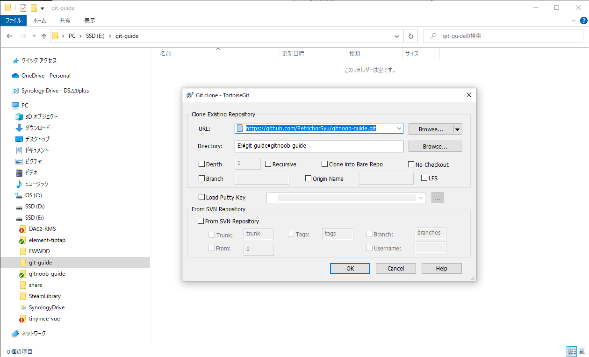

# Git 基本操作手顺

> 通过TortoiseGit操作和通过命令行操作。

## 克隆代码

### 取得克隆地址

测试用仓库地址：`https://github.com/PetrichorSyu/gitnoob-guide.git`

### 克隆

#### TortoiseGit

#### 命令行

`")

## 创建作业用分支，提交，推送

#### TortoiseGit

#### 命令行

## 合并作业分支至主分支

这里只介绍一种方法，通过网页创建`pull request`。

## 合并主分支最新代码至个人分支

假定主分支以下变更：

`test1.txt` 第一行有更新

`test2.txt` 最后一行有更新

`test3.txt` 新建

假定个人分支以下变更：

`test1.txt` 第一行有更新

`test2.txt` 第一行有更新

`test4.txt` 新建

### 从主分支取得代码

### 冲突解决

### ※冲突解决后代码提交※

根据项目经验，此处很容易出错。（一般会根据svn使用经验，revret掉不是自己的代码，这样做是错误的！切记！）可确认下TortoiseGit的提醒信息！

根据项目经验，此处很容易出错。（一般会根据svn使用经验，revret掉不是自己的代码，这样做是错误的！切记！）可确认下TortoiseGit的提醒信息！

根据项目经验，此处很容易出错。（一般会根据svn使用经验，revret掉不是自己的代码，这样做是错误的！切记！）可确认下TortoiseGit的提醒信息！

Commit后再执行push操作，推送至个人远程分支。

## 操作杂项

### 切换分支

### 取得代码

### 推送代码到远程分支

### 查看提交履历

